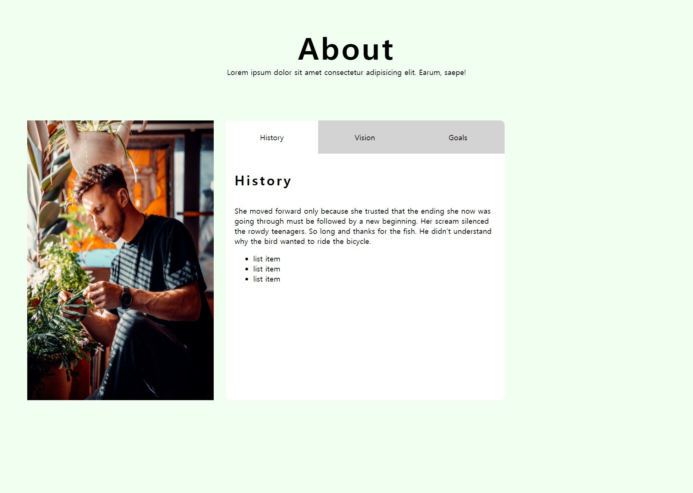
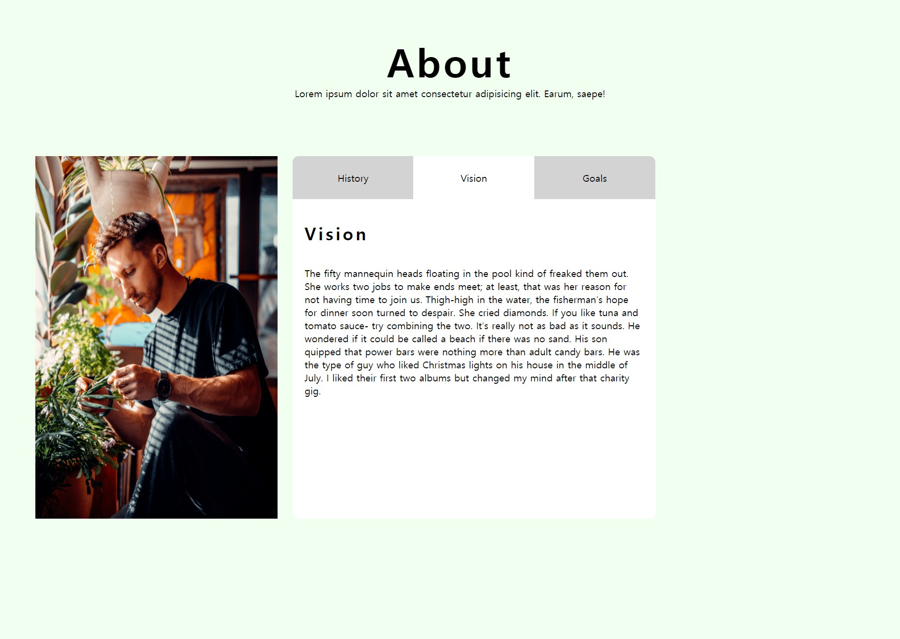

# Tab-Project
 
<ol>
  <li><strong>프로젝트 이름</strong> : Tab-Project</li>
  <li><strong>사용 언어</strong> : HTML, CSS, Vanila Javascript</li>
  <li><strong>주요 기능</strong> 
    <ul>
      <li>각 탭을 클릭할시, 그에 따른 다른 컨텐츠가 표시됩니다.</li>
    </ul>
   </li> 
  <li><strong>배운점</strong>: 
    1. 아주 원시적인 수준의 tab이다. 특히 컨텐츠를 html에 일일이 작성해놓고 display:none을 이용해 감췄다가 보여줬다가 하는 수준을 벗어나야한다고 생각한다.
    2. 그 방법으로는 json 등에 file을 저장한 후, fetch로 불러오는 방법(innerHTML = 불러온 내용) 등이 있겠다.

   
   
  <h5> 메인 화면 </h5>
   
  
  <h5> 탭 클릭시 </h5>
   
  

     
